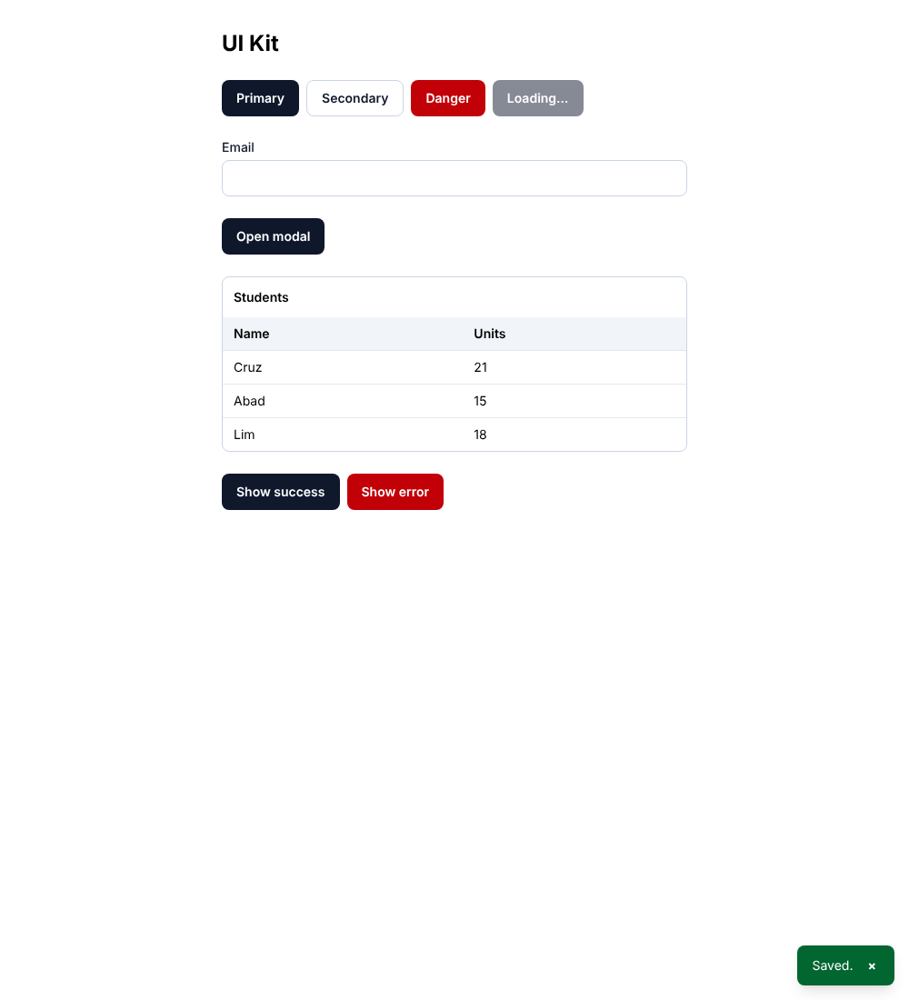
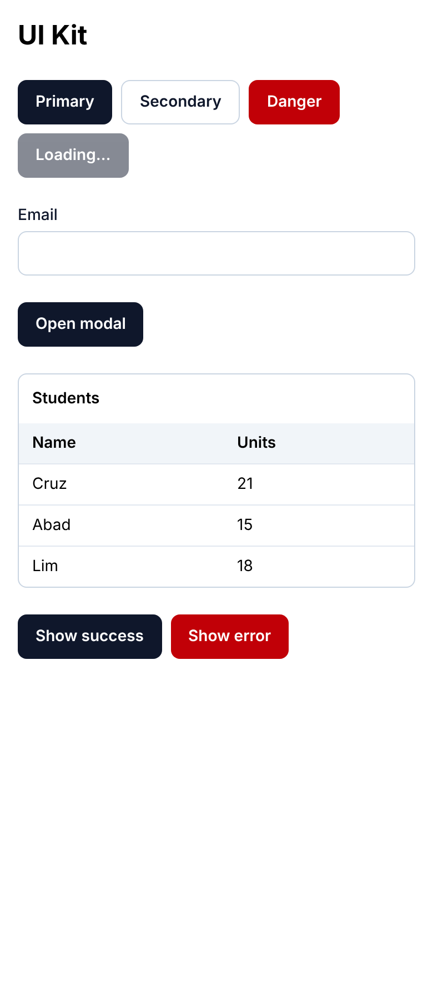

# UI Kit

Small React + TypeScript + Tailwind component kit with tests. Project 1 of
`ROADMAP.md`. Built to move into its own repository.

**Live demo:** https://ui-kit-almariebu.vercel.app





## Components

| Component | Notes |
|---|---|
| `Button` | primary / secondary / danger, loading state (`aria-busy`) |
| `Input` | label linked by id, error announced with `role="alert"` |
| `Modal` | native `<dialog>`: focus trap, Escape to close |
| `Table` | typed columns, sortable headers with `aria-sort`, empty state |
| `Toast` | `ToastProvider` + `useToast()`, polite live region, auto-dismiss |

To add next: Select, Tabs.

## Run

```bash
npm install
npm run dev        # demo page
npm test           # Vitest + Testing Library
npx playwright install chromium
npm run e2e        # Playwright, desktop + phone width
```

## Tests

- Unit: behavior and accessibility attributes for each component.
- End to end: validation flow, modal open/close with keyboard, no horizontal
  scroll at 360px.
- CI: `.github/workflows/ci.yml` (active once this folder is its own repo).

## Before publishing

- [x] Add screenshots to this README.
- [x] Deploy the demo (Vercel) and add the live link.
- [x] List React, TypeScript, and Tailwind on the portfolio and CVs.
